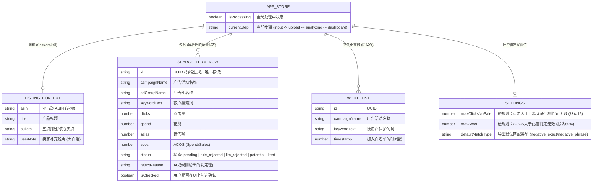

# 亚马逊广告智能分析流 (MVP) - 系统架构设计 v1.0

## 技术栈选型

**技术栈**：Next.js (App Router) + TypeScript + Tailwind CSS + shadcn/ui + Zustand (配合 LocalStorage 持久化) + Papa Parse (前端 CSV 解析) + Vercel AI SDK

**核心架构理念**：客户端重计算（保护隐私），服务端轻调度（仅作 LLM 代理防密钥泄露）

---

## 1. 项目目录结构树

遵循 Next.js App Router 的最佳实践，我们将业务逻辑、UI 组件与全局状态进行严格解耦：

```
amazon-ad-flow/
├── docs/                             # 架构与需求文档库
│   └── architecture.md               # 本文档存放处 (保持实时更新)
├── src/
│   ├── app/                          # Next.js App Router 路由层
│   │   ├── api/
│   │   │   └── analyze/
│   │   │       └── route.ts          # 【后端 API】大模型语义分析流式接口 (Vercel AI SDK)
│   │   ├── layout.tsx                # 全局根布局 (注入字体、全局 Toast 等)
│   │   ├── page.tsx                  # 【核心单页应用】承载四大核心交互区块
│   │   └── globals.css               # 全局样式与 Tailwind 指令
│   ├── components/                   # React 组件层
│   │   ├── features/                 # 业务功能组件 (按 PRD 模块划分)
│   │   │   ├── ContextInput.tsx      # 【模块1】Listing 与上下文录入区
│   │   │   ├── ReportUploader.tsx    # 【模块2】STR 报表拖拽解析区
│   │   │   ├── DiagnosticDash/       # 【模块3】诊断大盘 (含子组件)
│   │   │   │   ├── RuleTable.tsx     # 规则脱水建议表格
│   │   │   │   ├── SemanticTable.tsx # LLM 语义诊断表格
│   │   │   │   └── PotentialTable.tsx# 长尾潜力词表格
│   │   │   └── ExportPanel.tsx       # 【模块4】一键导出 CSV 面板
│   │   ├── ui/                       # 原子 UI 组件 (由 shadcn/ui 自动生成，勿手动大幅修改)
│   │   │   ├── button.tsx, table.tsx, badge.tsx, tooltip.tsx ...
│   │   └── layout/                   # 页面布局组件 (Header, Footer, 导航等)
│   ├── lib/                          # 纯函数与核心引擎工具库
│   │   ├── csv-parser.ts             # 封装 Papa Parse 解析报表
│   │   ├── csv-exporter.ts           # 封装 Amazon Bulk V3.0 格式导出逻辑
│   │   ├── rules-engine.ts           # 【核心】硬规则脱水引擎 (判断高点击无转化等)
│   │   └── utils.ts                  # Tailwind 类名合并 (cn) 等通用工具
│   ├── store/                        # 状态管理层
│   │   └── useAppStore.ts            # Zustand 全局 Store (含持久化配置)
│   └── types/                        # TypeScript 类型守卫层
│       └── index.ts                  # 核心数据结构接口定义
├── tailwind.config.ts                # Tailwind 配置文件 (配合 shadcn/ui)
├── components.json                   # shadcn/ui 配置文件
└── package.json                      # 依赖管理
```

---

## 2. 核心数据模型 Schema

由于我们采用方案 A（无云端数据库），这里的 Schema 实际上代表了 Zustand 全局状态树以及存入 浏览器 LocalStorage 的数据结构。严格的数据结构是保证前端逻辑不出错的基石。



---

## 3. 核心状态管理与数据流转说明

采用 Zustand 作为唯一的数据源（Single Source of Truth）。整个工作流的数据流转如下：

### 输入与拦截 (Client-side)

- 用户在 `<ContextInput />` 输入 Listing 信息，调用 `store.setListingContext(data)` 存入内存
- 用户在 `<ReportUploader />` 拖拽 CSV 文件，触发 `csv-parser.ts`（基于 Papa Parse）
- 由于是纯前端解析，不消耗服务器带宽。解析结果转换为 `SEARCH_TERM_ROW` 数组格式，存入 Zustand

### 规则脱水引擎 (Client-side)

- 数据入库后，自动触发前端 `rules-engine.ts`
- 系统遍历数组，检查 Clicks 和 ACOS 是否触发阈值
- 命中的词状态被标记为 `rule_rejected`
- 同时，引擎比对 `WHITE_LIST`，若命中白名单，强制将状态置为 `kept`

### 大模型语义并发推理 (Client-Server-Client)

- 对于留下来的 `pending` 词，前端提取 `keywordText`，结合 `ListingContext`，向后端的 `/api/analyze` 路由发起 HTTP POST 请求
- 后端 API (`route.ts`) 作为一个安全代理，拼接 System Prompt，调用 Vercel AI SDK 的 `generateObject` 发送给 OpenAI/Claude
- API 返回严格的 JSON 数组结构。前端拿到结果后，更新 Zustand 中对应词的 status (如更新为 `llm_rejected` 或 `potential`) 和 `rejectReason`

### 交互与闭环 (Client-side)

- `<DiagnosticDash />` 根据 Zustand 中的数据进行渲染分发（按 status 分类展示）
- 用户在表格中取消勾选某一行，触发 `store.toggleCheck()`，并同时触发 `store.addToWhiteList()` 将该词写入白名单（同步写入 LocalStorage）
- 点击导出，前端读取 Zustand 中所有 `isChecked === true` 且状态为 `rejected` 的词，通过 `csv-exporter.ts` 构建亚马逊标准格式，利用浏览器 Blob API 直接触发文件下载

---

## 4. 路由设计 (Next.js App Router 规范)

考虑到本工具追求极致的高效与低门槛，我们采用单页沉浸式应用 (SPA) 的体验架构，因此路由极其精简：

| 路由路径 | 类型 | 功能说明 | 权限/保护 |
|---------|------|----------|----------|
| `/` | Page (前端页面) | 核心工作台 (Main Dashboard)。通过内部状态机实现不同区块的平滑展现。包含上下文输入、报表上传、大盘分析及导出所有 UI。 | 默认开放 |
| `/api/analyze` | Route (服务端 API) | AI 语义推理引擎代理。接收前端传来的词汇与上下文，组装 Prompt，请求 LLM 并在服务端进行 JSON 格式强校验后返回结果。 | 防 CORS 限制，隐藏大模型 API Key。后续可在此处增加 IP 限流 (Rate Limit) 防刷。 |

---

## 版本历史

| 版本 | 日期 | 变更说明 |
|------|------|----------|
| v1.0 | 2026-02-27 | MVP 初始版本架构设计 |
